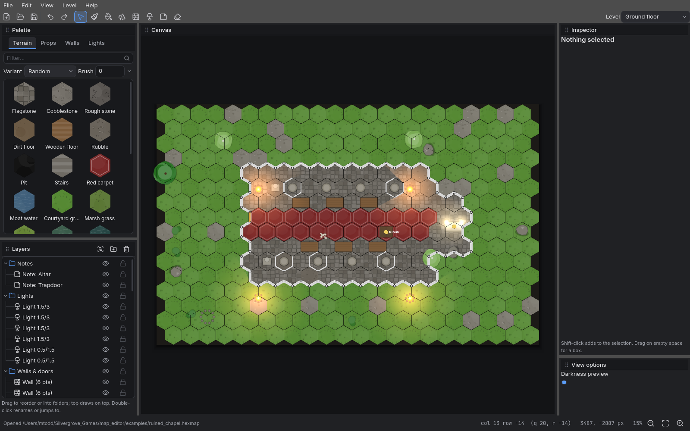

# Hexmap

Hex-grid encounter maps for tabletop RPGs, built in Godot 4.7. One
application, three modes:

- **Editor** — paint terrain by the hex, place props by the pixel, draw
  walls and doors, put down lights, then export to the virtual tabletops
  people actually use (Universal VTT, Foundry VTT, Tiled) or to a
  print-ready PDF with hexes at a real physical size.
- **Table** — run a campaign: the party's sheets, the NPCs, notes and
  handouts, a library of maps with prepared fights and a regional map
  that leads to them; sessions on those maps with tokens, doors, lights,
  fog, turn order, and a look at the scene through each player's eyes.
- **Player** — see the map from your tokens' eyes and move them, on a
  laptop, tablet or phone. Joins a Table on the same wifi (it finds them
  by itself, or you type the address the Table shows), or opens an
  encounter on the same device.

The Editor and the Table are desktop tools (macOS, Windows). The Player is
built to run everywhere, so the modules it shares with the others stay free
of desktop assumptions; see `ARCHITECTURE.md`.

It is a tool for people who make game systems, not a consumer product: the
map format is plain JSON meant to live in git next to the adventure text,
maps carry no rules so one map serves many systems, and content (terrain,
props, wall styles, light presets) comes from *packs* that are just folders
of images with a manifest — so art can be its own repository.



## Running it

`./run.sh` is the entry point on macOS and Linux/WSL. It finds Godot 4.7 —
in `$GODOT`, on `PATH`, in the usual macOS app locations — and if there
isn't one, downloads the pinned build to `~/.cache/hexmap/godot`.

```sh
./run.sh                                  home screen: pick a mode
./run.sh examples/ruined_chapel.hexmap    open a map in the editor
./run.sh editor                           the editor with a new map
./run.sh table                            the table
./run.sh player                           the player client
./run.sh export examples/forest_road.hexmap pdf out/forest.pdf hex_size_in=1 dpi=300
./run.sh export examples/forest_road.hexmap all out/forest   # one of everything
./run.sh test                             unit tests (headless)
./run.sh check                            parse every script
./run.sh doctor                           what it found
```

Three example maps are in `examples/`: a woodland road with a camp
(pointy-top hexes), a bog crossing to a witch's hut (flat-top hexes), and a
ruined chapel with a crypt level — plus an encounter on the chapel. Three example packs are in `packs/`, with
generated placeholder art.

## Using the editor

Tools are on the toolbar and on single keys: **V** select, **B** paint,
**G** fill, **P** prop, **W** wall, **L** light, **N** note, **E** erase.
Picking something in the left palette switches to the matching tool.

- **Palette** (left): one search box across every pack and tab; assets
  grouped under collapsible pack headers with Favourites (right-click a tile
  to star it) and Recent on top; hover a tile for a full-size preview.
  Picking switches to the matching tool, and picking a tool shows its tab.
- **Tool options** sit in the strip under the toolbar and change with the
  tool: brush size and variant, snapping, rotation/scale/flip for props,
  wall type, light radii and colour.
- **Paint** puts the palette terrain on hexes; drag to stroke, right-drag to
  clear, `[` `]` change brush size. Variants are random unless you pick one.
- **Prop** places the palette prop where you click. Snapping (off / hex
  centre / hex corner) is in the tool options; hold Shift for free placement.
  **R** rotates 15° (Shift: 1°), **F** flips, `[` `]` scale. Props that carry
  a light (campfires, braziers) place the light too.
- **Wall** adds a point per click, snapped to hex corners (Shift: free);
  Enter, double-click or right-click finishes, Esc cancels. The *type* in
  the palette is what the wall blocks — wall, door, secret door, window,
  fence, terrain, invisible, ethereal — and the *style* is how it draws.
  Doors finish themselves after two points.
- **Select** picks whatever is under the cursor (hover shows what you'd
  get); drag to move, Shift-click to add, drag on empty space for a box.
  A selected prop shows corner handles to scale and a handle above it to
  rotate (Shift snaps to 15°); a selected light shows handles on its bright
  and dim rings. Arrow keys nudge by one authored pixel (Shift: ten). The inspector on the right edits every field,
  including positions in pixels at the map's authoring density
  (`reference_ppx`, default 256 px per hex) for artists who think that way.
- **Panels dock.** Every panel has a title bar with a grip; drag it onto
  another panel to group the two as tabs, or onto a panel's edge to split.
  The arrangement is remembered per user; View → Reset panel layout restores
  the default (Palette over Layers, canvas, Inspector over View options).
- **Theme** is under View → Theme: Slate, Forge, Studio or Parchment,
  remembered per user.
- **Layers** lists every element on the level, Photoshop style:
  folders, eye and lock toggles, drag to reorder or to move into a folder —
  which never moves anything on the canvas. Top of the list is drawn on
  top. Selecting a row selects on the canvas and vice versa; double-click
  jumps to it or renames it. **Group** (Ctrl/Cmd+G) wraps the selection in a
  new folder. Hidden layers are left out of exports; locked ones can't be
  picked. Clicking the same spot on the canvas again cycles through whatever
  is stacked there.
- **Lights** cast shadows from anything whose wall type blocks light (closed
  doors included), so the preview shows where a torch actually reaches.
- **Levels** (floors) are in the toolbar dropdown and the Level menu.
- **View** toggles the grid, walls, lights, notes and GM-only objects, and
  the darkness slider previews where lights reach.

Undo is unlimited within a session. The map autosaves beside its file every
minute while dirty, and offers to restore that on open if it is newer.

Space+drag or middle-drag pans, the wheel zooms, Ctrl/Cmd+0 fits.

## Using the table

Pick Table on the home screen and start a campaign (or
`./run.sh table reach.campaign`). The campaign is the document: its
**Party** and **NPCs** panes show every character's sheet as the rules
plugin draws it, editable by the DM between sessions; **Notes** holds
what you write ahead and hands it to the players' phones when the moment
comes; **Maps** is the library — maps drawn in the Editor, never changed
here — with prepared fights (creatures found by name, type and CR, with
counts and cells) to *Launch*, or to *Stage* out of the players' sight
and *Go* when it is arranged, and *Return* from, and places on a
regional map that lead to them;
**Session** starts and ends the session, hosts for the phones and keeps
the clock. On a scene, place tokens with the Token tool, click doors to
open them and lights to put them out, brush fog away as the party
explores — or leave fog on and let their tokens' vision reveal it. "See
as" shows the scene the way a player will get it. Turns are **free**,
**DM picks**, or **ordered** by a turn system. An old `.encounter` file
opens as a campaign of its own. `docs/campaign-plan.md` is the design,
`docs/campaign-format.md` and `docs/encounter-format.md` the formats, and
nothing in them edits a map.

The rules come from **rulesets**: plugins in sandboxed Lua that run on
the Table only. A ruleset is a zip (its `manifest.json` at the root, or
in one top folder) — *Install ruleset…* in the **Rules** pane unpacks it
under the Table's plugins folder and loads it; *Reload rules* picks up
one you dropped in by hand; *Plugins folder* opens that folder. The 5E
compatible ruleset is `Silvergrove-Studios/ruleset-dnd5e`
(`srd5e-<version>.zip` on its Releases page). `docs/plugin-authoring.md`
is how to write one.

## Using the player

On the Table, press **Host** (or Network → Host on this network); the
status bar shows the address. On the Player, tables on the wifi appear by
themselves — tap one, or type that address — then pick who you are. You
get the scene the table is showing, through your tokens: fog, their
vision, nothing the DM has hidden; maps and art you lack stream from the
table. Drag a token of yours to move it — the table's turn mode decides
whether that is allowed right now, and you are told if not. Everything is
sized for a finger: pinch to zoom, two fingers to pan, tap a token button
to find it. `./run.sh player examples/chapel_ambush.encounter` opens an
encounter on this device instead, for a second screen or a preview.

## Builds

`.github/workflows/release.yml` builds a debug-signed **Android APK** and
Linux, Windows and macOS zips. Push a `vX.Y.Z` tag and they land on that
release; run the workflow by hand and they land on the `dev-build`
prerelease. Sideload the APK, open Player, and it lists Tables hosting on
your wifi. `tools/check_export.gd` mounts an exported pack and checks the
files the app reads itself (icons, fonts) made it in — they are marked
"keep" so Godot ships them raw.

## UI size

Text too small? View → UI size in the editor and the table (Ctrl/Cmd+=
and Ctrl/Cmd+− step it), the −/+ on the home screen, or A−/A+ on the
Player's join screen. It is remembered. The app already scales with the
screen's own factor (Retina, Windows display scaling, phone density);
this sits on top of that.

## Files

- `name.hexmap` — the map, JSON. See `docs/map-format.md`.
- `name.encounter` — an encounter over one or more maps: tokens, doors,
  lights, fog, initiative. See `docs/encounter-format.md`.
- `packs/<id>/pack.json` — a content pack. See `docs/pack-format.md`.
- Exports and how each target is mapped: `docs/exports.md`.
- Why these formats: `docs/research-formats.md`.
- How the code is put together: `ARCHITECTURE.md`.

## Licence

MIT — see `LICENSE`. Third-party components and formats are listed
in `THIRD_PARTY.md`; the placeholder art under `packs/` is Silvergrove
Studios' and is MIT with the rest. Rulesets are separate projects with
their own licences.

## Content packs

A pack is a folder with a `pack.json` and images (SVG, PNG, WebP, JPEG).
The editor looks in `packs/` here, `user://packs/`, a `packs/` folder next to
the executable, and any folders added under Edit → Pack folders. Packs are
read straight off disk at run time — no Godot import step — so an art
repository can be cloned anywhere and pointed at.

The three packs here (`woodland`, `swamp`, `dungeons_and_castles`) are
examples with placeholder art generated by `tools/gen_pack_art.gd`. Replace
the files in place and the manifests keep working.

## Developing

Scripts live under `hexmap/` (`shell/` app root and home screen, `core/`
model and geometry, `render/` drawing, `io/` file formats and exporters,
`editor/` the Editor, `table/` the Table, `player/` the Player, `ui/` theme
and shared widgets), tools under `tools/`, tests under `tests/`. `./run.sh
check` parses every script and fails if a portable module (`core/`,
`render/`, `encounter/`, `net/`, `player/`) uses a desktop-only class. `./run.sh test` runs the unit tests headless;
`./run.sh export … all` is the end-to-end smoke test for everything that
renders; `godot --path . -s tools/ui_smoke.gd -- out/ui` screenshots the
editor in several states.

Add tests as you add features: `tests/test_suite.gd` is a flat file of
`test_*` functions with `check(cond, message)`; `./run.sh test <name>`
runs the ones matching. The same suite runs inside any build with
`--selftest` (results in `user://selftest.txt`), which is what the
`desktop-test`, `android-test` and `ios-test` workflows do on real
macOS/Windows/Linux runners, an emulator and a simulator — see
`ARCHITECTURE.md`. None of the workflows runs on a push to `dev`: `ci`
runs on pull requests, on pushes to `main` and on tags, and every
workflow runs by hand — `gh workflow run ci.yml --ref dev` (likewise
`desktop-test.yml`, `android-test.yml`, `ios-test.yml`, and
`release.yml` for a `dev-build` prerelease). Minutes on a private repo
are finite, and macOS ones count tenfold.
