# The journey a new DM and a new player take (J1)

Walked 2026-09-24 on Hexmap `dev` after the playtest-1 fixes, with "The
Ruined Chapel" package, by `tools/journey_shots.gd`, which drives the real
windows and screenshots each screen:

    ./run.sh godot --path . --resolution 1440x900 -s tools/journey_shots.gd -- <out dir> <package>

For each screen: what a first-time DM (or player) has to know that the
screen does not tell them. The playtest said they could not find their
way onto a map or start anything; these are the reasons.

## 1. Home

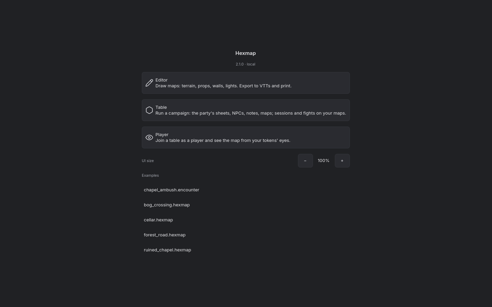

- The first choice is **Editor / Table / Player**: the app's three
  modes, in the order it was built. A DM who came to *run a game* has to
  know that "Table" is the word for that. Editor comes first.
- **Examples** is a list of raw file names (`chapel_ambush.encounter`, a
  format from before campaigns; four `.hexmap` maps). Nothing says what
  opening one does, and a downloaded campaign package is not among them.
- Nothing here is about *campaigns*, which is what the Table is now
  built around.

## 2. The Table's first screen

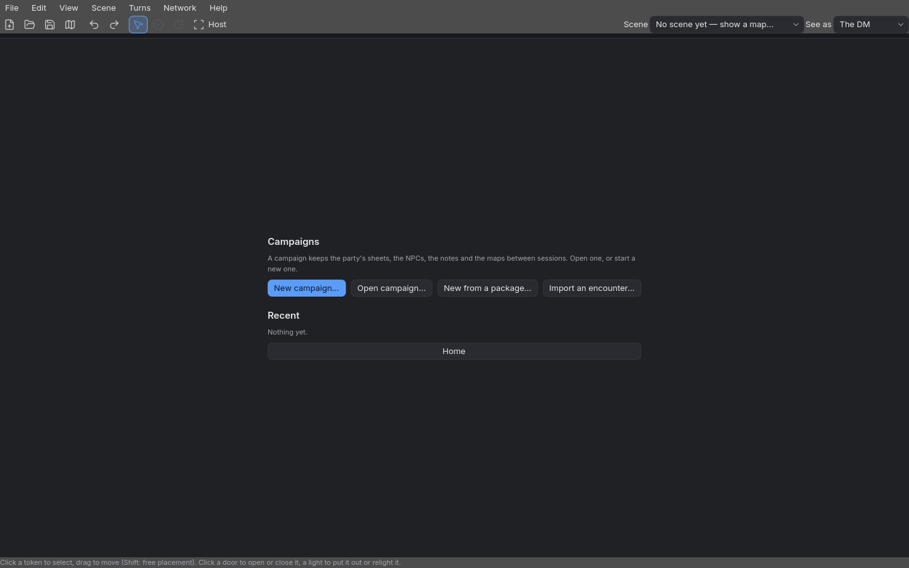

- The whole editing chrome is up with **nothing to edit**: File / Edit /
  View / Scene / Turns / Network / Help, a toolbar of ten unlabelled
  icons, *Scene: No scene yet*, *See as: The DM*, *Host*. None of it
  means anything until a campaign is open; all of it competes with the
  four buttons that do.
- **Four ways in, side by side, equal**: New campaign, Open campaign, New
  from a package, Import an encounter. The one a new DM with a
  downloaded adventure wants — the package — is third, in the same grey.
- The package list ("Campaigns to start") only shows packages already in
  the app's library folder; a file in Downloads is not there, so the
  list is empty for exactly the person it is for.
- *Home* is a full-width bar under an empty "Recent".

## 3. Starting a package

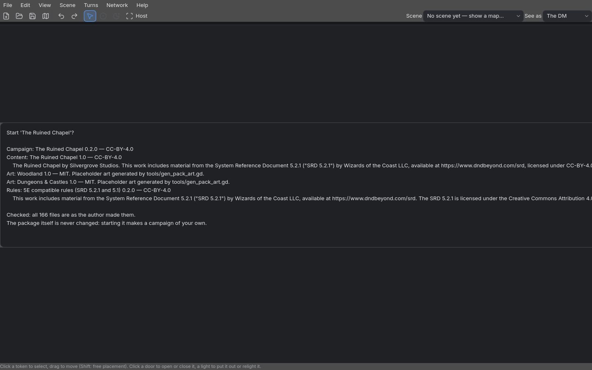

- The first thing a DM reads about the adventure is **licence text**:
  CC-BY attributions, a runs-off-the-screen SRD notice, "Placeholder art
  generated by tools/gen_pack_art.gd". The adventure's own description —
  who it is for, what it is about — is not shown at all.
- The dialog is wider than the window; the text is clipped.
- Then a second dialog asks for a name, then the campaign opens: three
  steps with no sense of where they lead.

## 4. The campaign, open

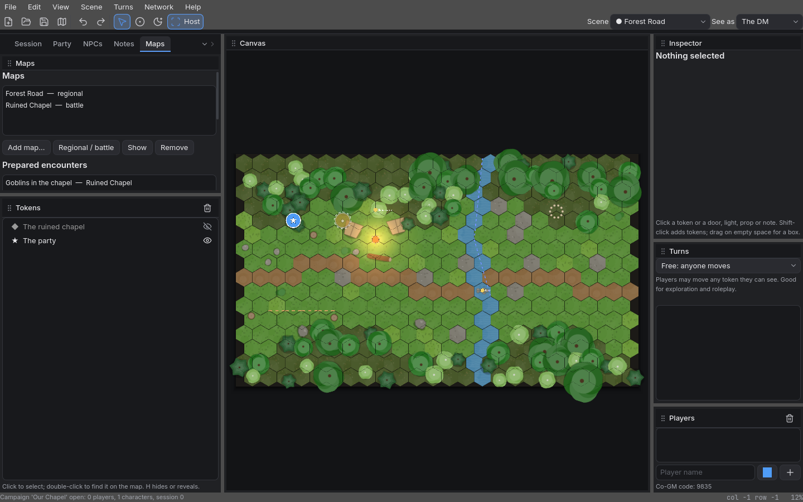

- **The Getting started list (added after playtest 1) is invisible**: it
  is in the Session pane, which is a tab behind the Maps tab.
- **Eleven panes** are open at once — Session, Party, NPCs, Notes, Maps
  (tabs), Tokens, Canvas, Inspector, Turns, Players — plus the menu bar
  and toolbar. The Inspector is a tall empty box saying "Nothing
  selected"; Turns is an empty box; Players is an empty list with a
  "Player name +" field (players are not added by hand; they join).
- **The adventure's way in is not on the map.** The chapel is a place
  marker on the road, but clicking it does nothing: launching the fight
  is *Maps pane → Prepared encounters → select → Launch* (or the place
  list), none of which the screen points at.
- The party marker and the place marker are small glyphs a first-time DM
  does not know how to read; the place is hidden, drawn faint.
- The status bar (bottom left) is the only guidance, one line, easy to
  miss.
- Hosting is on (the playtest fix) but where players join — the address,
  the steps on the phone — is in the hidden Session pane.

## 5. The fight, launched

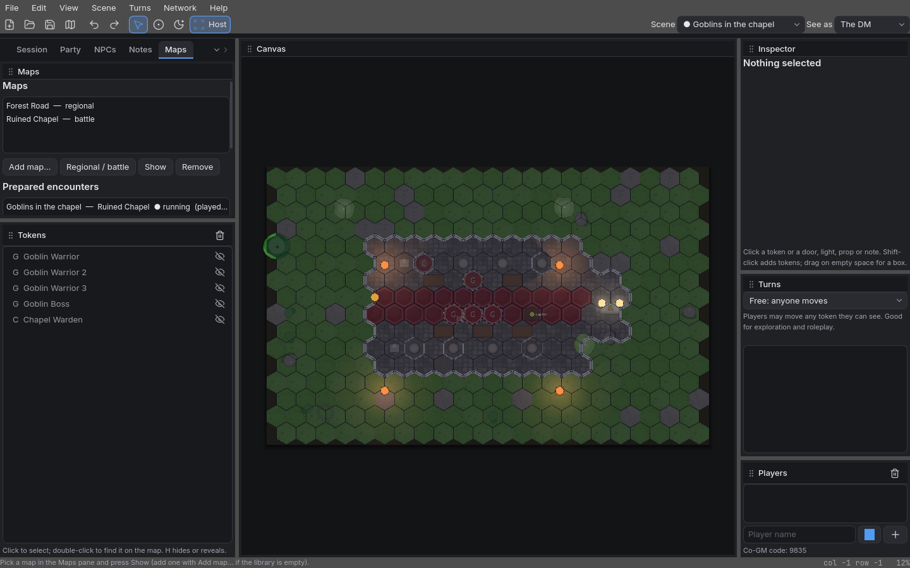

- It works: the chapel scene, five creatures hidden, their tokens listed.
  But the DM is still in the same all-panes layout, with no sense of
  "the fight is on": initiative, revealing the goblins and the Warden,
  the creatures' stat blocks are each somewhere else (Turns menu or
  pane, the Tokens pane's eye icons, the NPCs pane / Inspector).
- *Return* — getting back to the road afterwards — is in the Maps pane.

## 6. A player's first screen

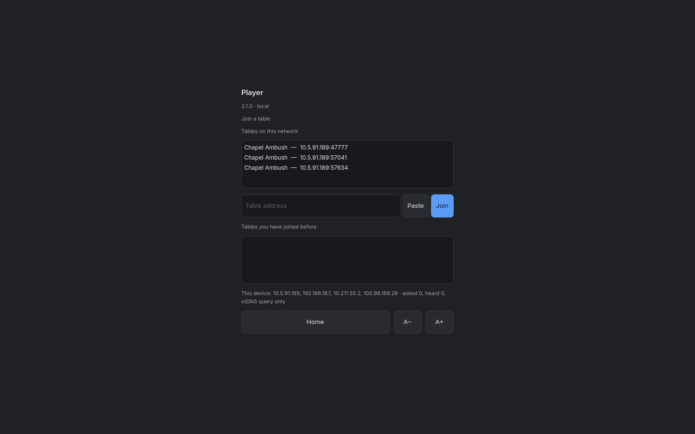

- **Tables on this network** lists three "Chapel Ambush" tables — tables
  left running by development and test sessions on this network (one
  from 20 September) — and *not* the DM's "Our Chapel". A table is
  announced under its live encounter's name, not its campaign's, and a
  stale entry is indistinguishable from a real one.
- A diagnostics line ("This device: 10.5.91.189, 192.168.18.1, … asked
  0, heard 0, mDNS query only") is developer information on a player's
  first screen.
- Nothing says what happens after joining: pick your character? make
  one?

## What it adds up to

1. **The Table is an editor with a campaign bolted on.** Its chrome
   (menus, tool bar, docked panes, "See as", "Scene") is the Editor's,
   shown before and regardless of what the DM is doing. A DM's work has
   phases — *starting*, *prepping between sessions*, *running a
   session*, *running a fight* — and the screen does not change between
   them.
2. **Nothing leads.** Every action is equally available and equally
   quiet; the one next step a DM needs is never the prominent thing.
3. **The map is not the place you act.** Places, the party, the fight
   are all driven from lists in panes, not from the map the DM is
   looking at.
4. **The words are the implementation's**: scene, place, prepared
   encounter, checkpoint, host, co-GM code, viewpoint.
5. **Players meet the network before the game**: discovery lists,
   addresses, diagnostics.

These are the inputs to the use cases (J2, `docs/use-cases.md`).

## Wave 2: the same journey, reshaped (2026-09-24)

The screens after the refactor (`docs/playtest-1.md`, "Wave 2"), walked by
the same tool with *The Ruined Chapel* 0.3.0.

| | |
|---|---|
| 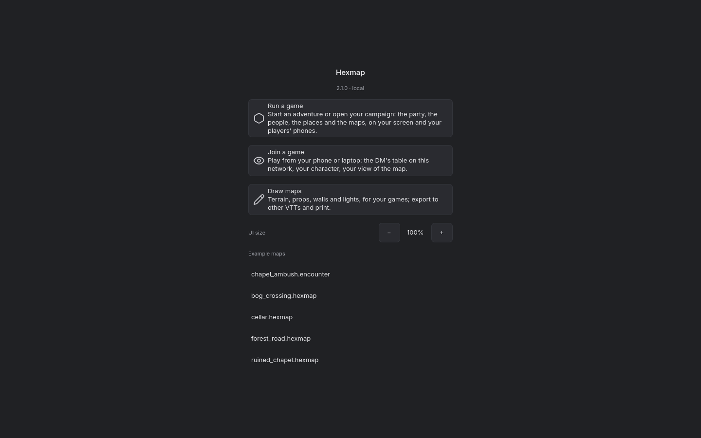 Home leads with running a game | 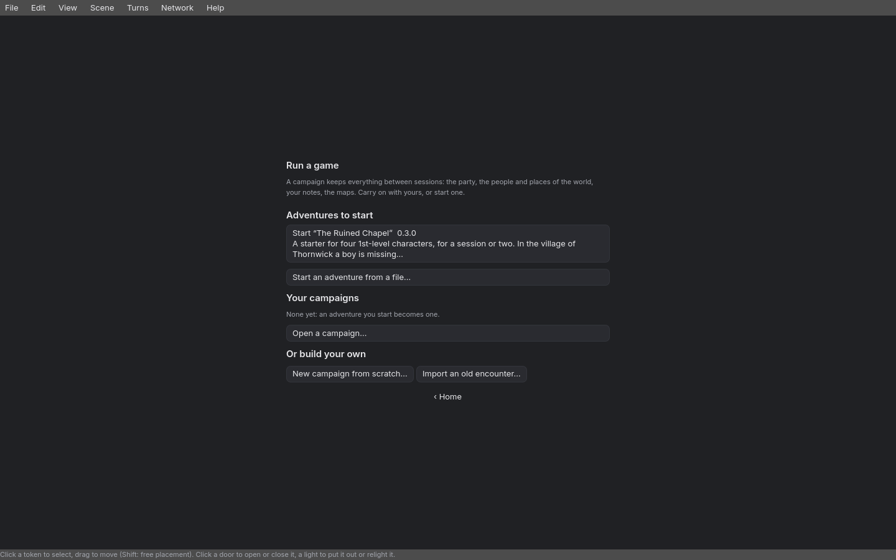 the Table's first screen: the adventure found, your campaigns |
| 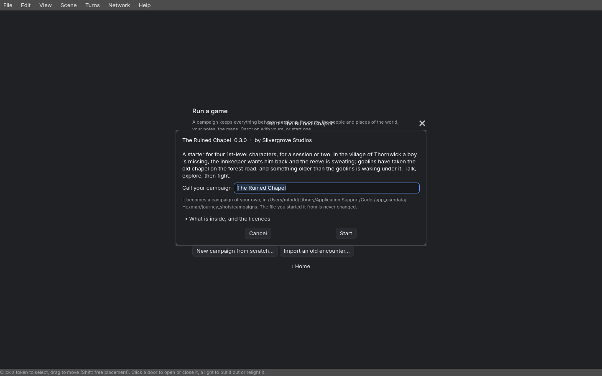 starting a package: the pitch first | 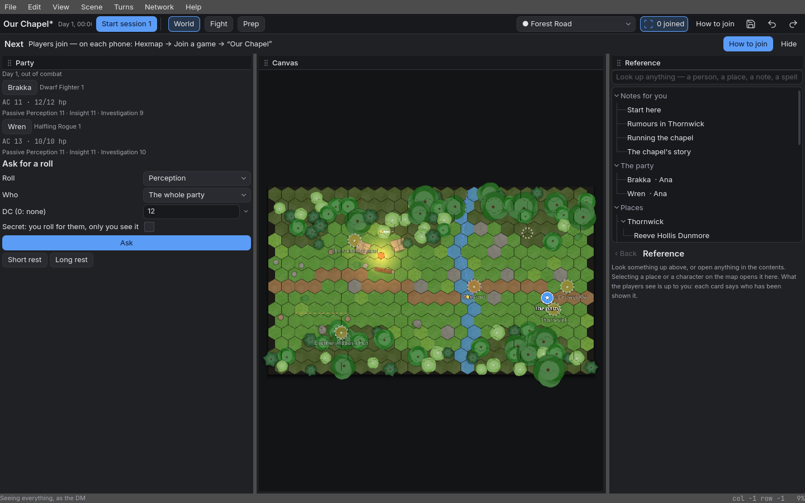 the World: the party, the road, the contents; *Next* says what to do |
| 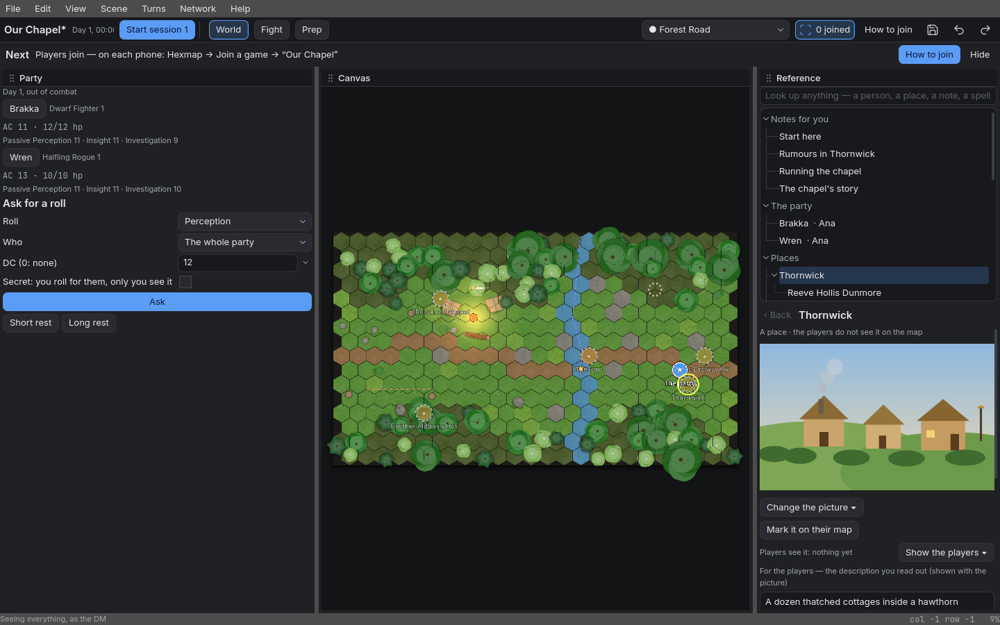 a place's card: picture, *Show the players*, the description | 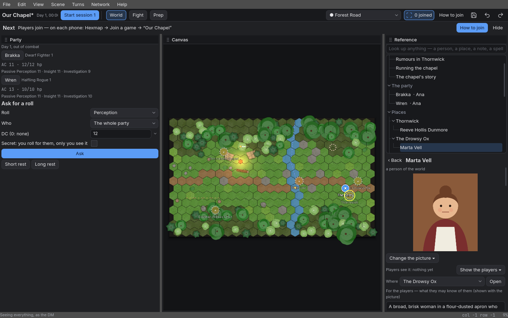 a person's card: portrait, where, what the players may know, the DM's notes |
| 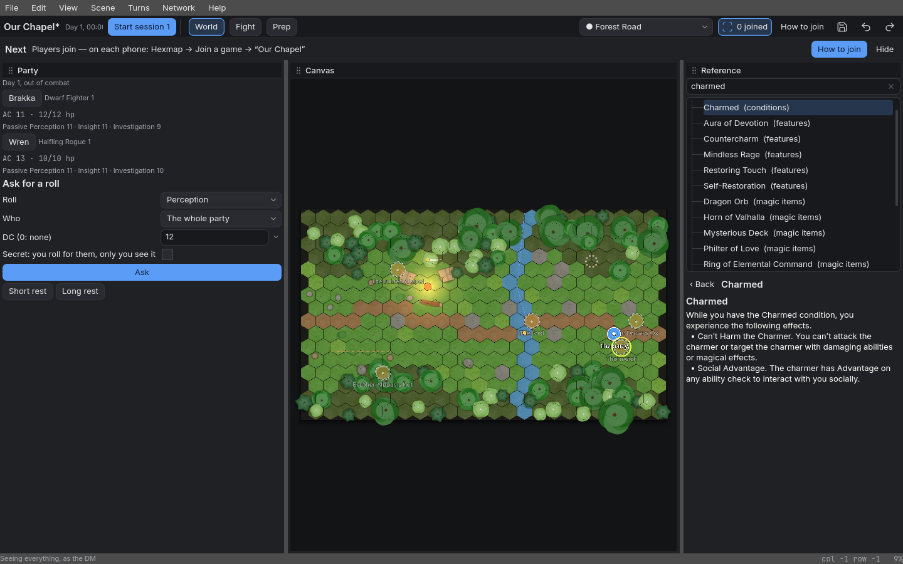 a rule looked up mid-conversation | 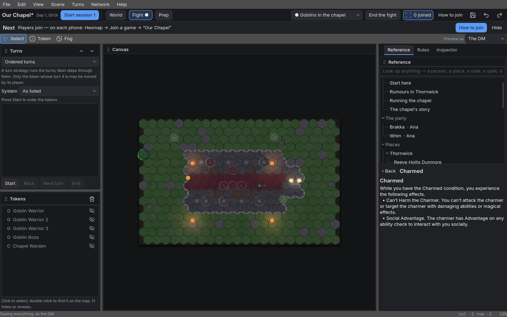 the Fight: turns, tokens, the reference |
| 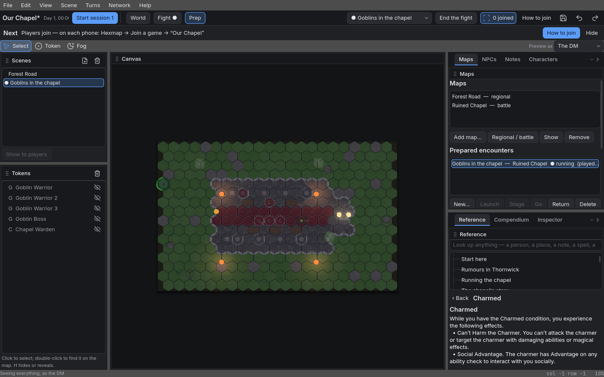 Prep: every pane | 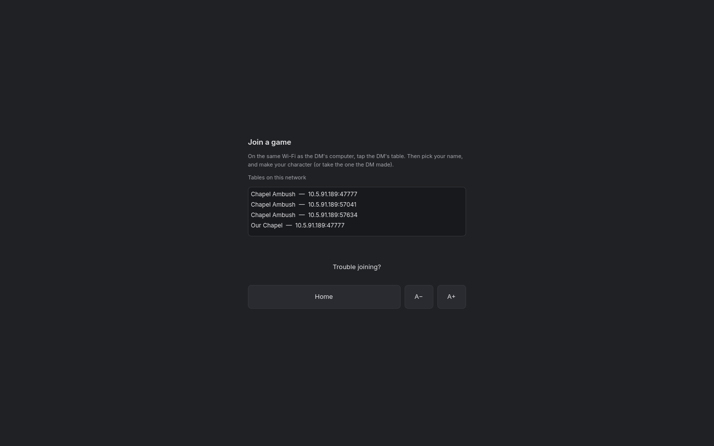 *Join a game* on a phone |
| 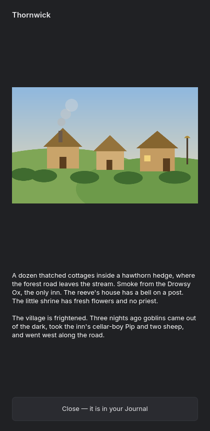 what the DM showed, on a phone | |

